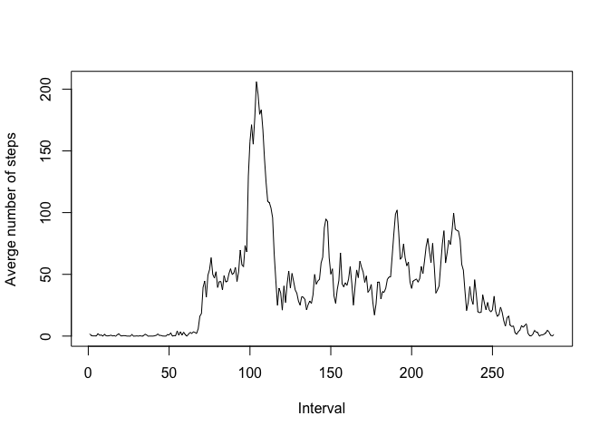
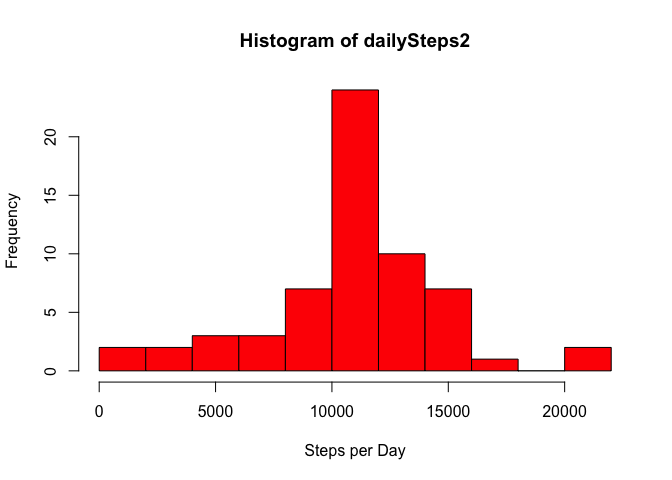
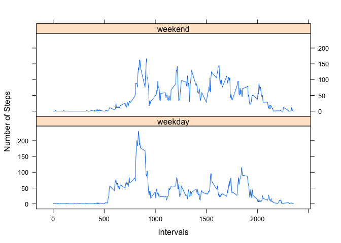

# Reproducible Research: Peer Assessment 1


## Loading and preprocessing the data

- Read csv data file from working directory.

```r
dat<- read.csv("~/activity.csv",header=T,sep=",")
```

## What is mean total number of steps taken per day?

- Calculate the total number of steps for each day and make a histogram.

```r
dailySteps<- tapply(dat$steps, dat$date, sum)
hist(dailySteps,col="red",breaks=10,xlab="Steps per day",main="")
```

 

- Calculate the mean and median for total number of steps per day.

```r
mean(dailySteps,na.rm=T)
```

```
## [1] 10766
```

```r
median(dailySteps,na.rm=T)
```

```
## [1] 10765
```


## What is the average daily activity pattern?

- Make the time series plot of 5-minute interval and the average number of steps taken, averaged across all days.
- Find which 5-minute interval, on average across all the days contains the maximum number of steps.

```r
dat$date<- as.Date(dat$date,"%Y-%m-%d")
averageSteps<- tapply(dat$steps, dat$interval, mean, na.rm=TRUE)
plot(averageSteps,type="l",xlab="Interval",ylab="Averge number of steps")
```

 

```r
which(averageSteps %in% max(averageSteps))
```

```
## [1] 104
```
From the previous result, the 104th 5-munite interval contains the maximum number of steps.

## Imputing missing values

- Calculate the total number of missing values.

```r
sapply(dat, function(x) sum(is.na(x)))
```

```
##    steps     date interval 
##     2304        0        0
```
There are 2304 missing values in steps in this dataset.

- Replace missing values by the mean for that 5-minute interval.

```r
newData<- dat # create a new dataset
newData$steps[is.na(newData$steps)] <- ave(newData$steps,newData$interval,FUN=function(x)mean(x,na.rm = T))[is.na(newData$steps)] #filling missings in the new dataset
sapply(newData, function(x) sum(is.na(x))) #check if there is no missing values in new data 
```

```
##    steps     date interval 
##        0        0        0
```

- Make the histogram and calculate the mean and median of new data without missing.

```r
dailySteps2 <- tapply(newData$steps, newData$date, sum)  # group by date and sum
hist(dailySteps2, col= 'red', breaks=10, xlab="Steps per Day")
```

 

```r
mean(dailySteps2)
```

```
## [1] 10766
```

```r
median(dailySteps2)
```

```
## [1] 10766
```

## Are there differences in activity patterns between weekdays and weekends?

- Create a new factor variable with two levels, "weekday" and "weekend".

```r
newData$day <- weekdays(newData$date)
newData$day<- with(newData,ifelse(day %in% c("Saturday","Sunday"),"weekend","weekday"))
```

- Make a time series plot of the 5-minute interval and the average number of steps taken, averaged across all weekdays or weekend days.

```r
library(plyr)
averageSteps3 <- ddply(newData, .(interval, day), summarize, average = mean(steps))
library(lattice)
xyplot(average ~ interval | day, data = averageSteps3, layout = c(1, 2), type = "l",
    xlab = "Intervals", ylab = "Number of Steps")
```

 
